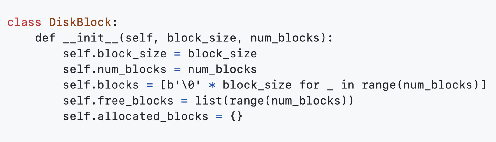
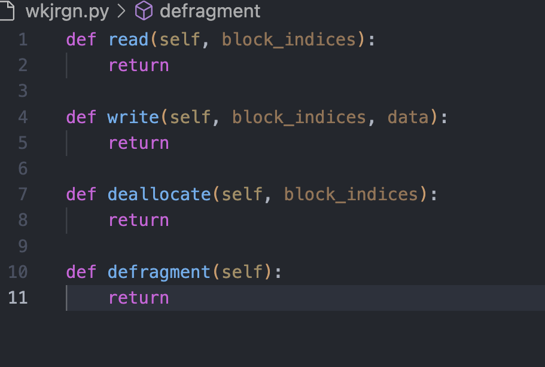

# **Database From Scratch**

While relational databases offer powerful data management capabilities, creating a simple database from scratch using Python is possible. This approach involves building functionalities similar to those found in relational databases:

* **Data Storage:** A mechanism to store data, often implemented using fixed-size blocks.

* **Free Space Management:** Techniques to track and efficiently utilize available storage space, potentially including defragmentation to consolidate free blocks.

* **Data Manipulation:** Functions to read, write, and allocate data within the storage structure.

**Object-Oriented Approach**

We can leverage object-oriented programming (OOP) to create a class named **DiskBlock** that simulates a disk with a fixed block size and a specific number of blocks. This class can manage the data stored within each block.

<!--  -->

**Adding Functionality**

Using Python's **def_()** keyword, we define functions within the DiskBlock class to perform essential tasks:

* **Finding Free Space:** Locates blocks that are currently available to store new data.
* **Allocating Blocks:** Assigns specific blocks to store incoming data.
* **Deallocating Blocks:** Releases previously allocated blocks, making them available for future use.
* **Reading Data:** Retrieves data from designated blocks.
* **Writing Data:** Stores new data within specified blocks.
    <!--  -->

By calling these functions with appropriate parameters, we can simulate basic data management operations within the **DiskBlock** object.

**Important Note:**

This approach offers a simplified model for understanding disk storage management. Building a full-fledged database involves additional functionalities like data schema definition, querying using SQL, and managing relationships between data entities. Consider exploring libraries like **sqlite3** or **SQLAlchemy** for more comprehensive database creation using Python.

### **After the disk block is created and the data is stored, how can you save the data in emergency cases?**
**RAID (Redundant Array of Independent Disks)** is a storage technology that protects data by replicating it across multiple hard drives or solid-state drives (SSDs). In case of a drive failure, the data remains accessible from the remaining functional drives. RAID offers data redundancy and improves fault tolerance.

**How to Implement RAID Functionality ?** 

Using Python object-oriented programming, we can simulate a simplified RAID system. This model divides and spreads data across multiple disks, with calculations for redundancy depending on the chosen RAID level.

To achieve RAID functionality, we create functions within the RAID class for operations like read, write, and rebuild.

#### **The Read Function:**

The read function simulates how a RAID system retrieves data based on the chosen RAID level (0, 1, or 5):

* **RAID 0 (Striping):** Reads data in stripes (chunks) across all disks. It iterates through each data disk starting from block_idx, jumping by num_disks to reach the next stripe. It then reads the corresponding block from each disk and combines them into a single data stream.

* **RAID 1 (Mirroring):** Reads from just one of the mirrored copies. It calculates the mirror disk index by dividing block_idx by 2 (assuming equal halves) and reads the data block from that specific disk.

* **RAID 5 (Distributed Parity):** Reads data blocks across all disks except the parity disk. It identifies the parity block index and skips it. Then, it reads data blocks from all other disks and combines them for the final data.

### **Write function**

To create a write function that will efficiently and securely store data within a Redundant Array of Independent Disks (RAID) system. This function will support various RAID levels, including RAID 0, RAID 1, and RAID 5.

### **Rebuild fnction**

Defining rebuild function , which is part of a class handling disk management in a RAID (Redundant Array of Independent Disks) system.

### **Buffer pool management**

The BufferPool class serves as a container for a buffer pool, offering functionalities to manage the caching of disk pages. 
Its initialization method sets up the buffer pool with a predetermined size, preparing it to store pages fetched from disk. 
The fetch_page method handles the retrieval of pages from the buffer pool. If the requested page is already cached in the buffer, the method updates its usage count, likely for eviction policies such as LRU (Least Recently Used). In case the page is not present in the buffer, indicating a cache miss, the method would fetch the page from disk, although disk fetching is not implemented in this example. 
Subsequently, if the buffer pool reaches its maximum capacity, the method ensures space for the new page by evicting the least recently used page. In essence, the BufferPool class facilitates efficient management of cached disk pages, optimizing access speed and minimizing disk I/O operations.

