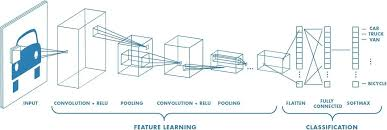
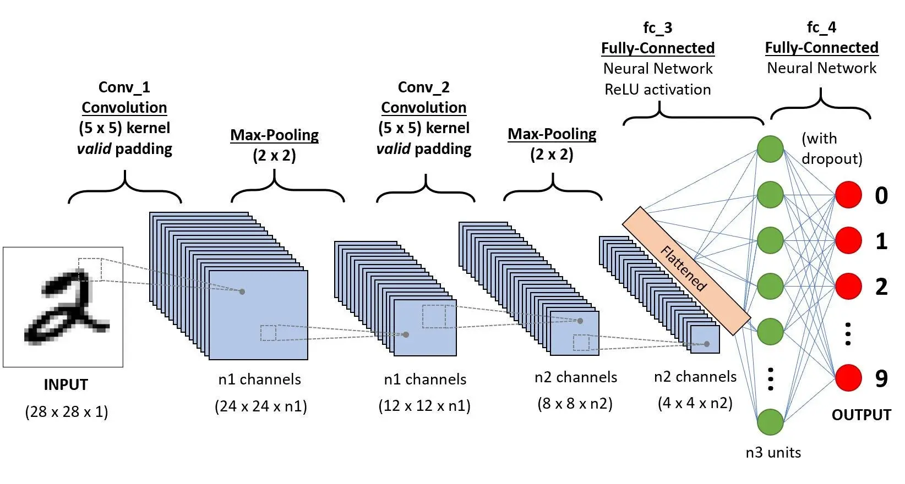
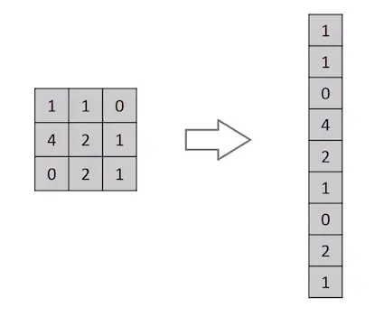
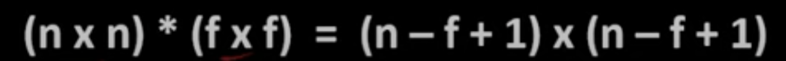

# **Convolutional Neural Networks**

In the vast landscape of artificial intelligence, there exists a cornerstone technology that has reshaped our understanding of image processing and pattern recognition: Just as the human brain processes visual information to understand the world around us, CNNs harness the power of deep learning to analyze and interpret images with remarkable precision and efficiency.

In this introduction, we embark on a journey to unravel the mysteries of CNNs, exploring their origins, fundamental concepts, and transformative impact on diverse fields ranging from computer vision to healthcare. 

Let's dive into the fascinating realm of Convolutional Neural Networks, where pixels transform into insights, and innovation knows no bounds.

## **Introduction**

A Convolutional Neural Network (ConvNet/CNN) is a Deep Learning algorithm that can take in an input image, assign importance (learnable weights and biases) to various aspects/objects in the image, and be able to differentiate one from the other.

The pre-processing required in a ConvNet is much lower as compared to other classification algorithms. While in primitive methods filters are hand-engineered, with enough training, ConvNets have the ability to learn these filters/characteristics

A ConvNet effectively captures spatial relationships in images through filter application. With fewer parameters and weight reusability, it fits image datasets better.

## **Why Convolutional Neural Networks over feeding images directly to ANN.**

An image is nothing but a matrix of pixel values so why not flatten the matrix into a vector and feed it to ANN like 

In the above case the model might be able to draw patterns easily but what of the input image is big (7680×4320), then the model will take computationally heavy resources and latency will also increase therefore Convolutional neural network is implemented to reduce the spatial dimensions of the input image without losing the image important feature.  

The role of Convolutional neural network is to reduce the images into a form that is easier to process, without losing features that are critical for getting a good prediction. This is important when we are to design an architecture that is not only good at learning features but also scalable to massive datasets.

Convolution is a mathematical operation that involves sliding a small matrix (called a kernel or filter) over the input data and computing the element-wise product between the kernel and the overlapped region of the input. 

This operation produces a feature map (the end image after convolution )that captures the presence of specific patterns or features in the input data.

CNNs use a series of layers, each of which detects different features of an input image. 

**What happens at each layer?**

A filter of values is slided across the pixel values of an image. When this happens, the values of these pixels are then changed and aggregated based on the matrix multiplication. 

## **What are kernels?**

In Convolutional neural network, the kernel is nothing but a filter that is used to extract the features from the images. 

The kernel is a matrix that moves over the input data, performs the dot product with the sub-region of input data, and gets the output as the matrix of dot products.

The output of each layer's kernels is then passed through a non-linear activation function, such as ReLU, to introduce non-linearity into the network and enable it to learn more complex and abstract features .

Images have properties like edges, shapes, and colors. The combination of these properties generates features. Kernels or filters are responsible for detecting these features in an image.

If the image is a grayscale image, then the pixel value will range between 0 and 255 (0 for black and 255 for white).

Grayscale image example. 

Example:

We have an image (5 x 5), a kernel of (3 x 3), and the kernel slides on the image. A new image is generated. The new image generated after the convolution is called the feature map.

When the kernel is placed in a new position, it calculates a dot product. The resulting product is placed in the corresponding position in the feature map.

Any image of size (n x n) when convolved with a kernel (f x f) will generate a feature map of size (n - f + 1) x (n - f + 1).

Convolution acts as a feature detector or edge detector. It detects all the edges in the input image.

