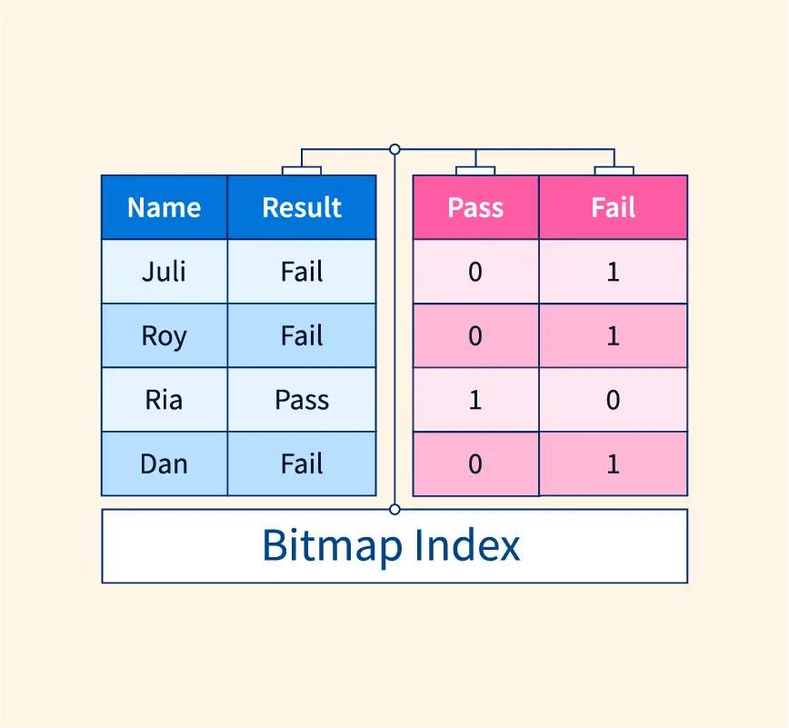
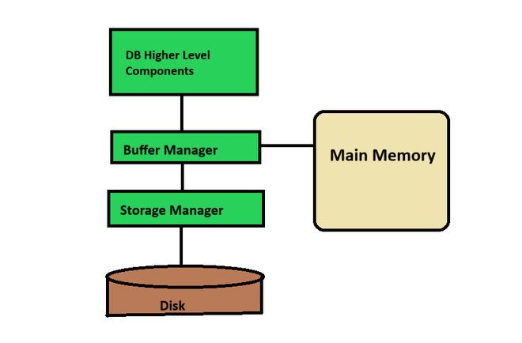

# **Indexing**

##  **Indexing of Spatial and Temporal Data** 

A spatial-temporal index is an advanced index structure where the indexing key is the location and timestamp of an object.

Indexing spatial and temporal data is a crucial technique for efficiently managing information that has both a location and a time component.

**Break down of the concept :**

**Spatial data :** This refers to information about the location of objects or events. Examples include positions on a map, sensor readings in a specific area, or delivery zones.

**Temporal data :** This deals with the time aspect of information. It could be timestamps, durations, or specific periods.

Indexing in spatial and temporal data helps users to quickly retrieve data containing time and location information.

## **Bitmap Indices** 

**What is Bitmap Indexing ?**

A bitmap index is a data structure used in databases to improve query performance. It stores bitmaps for each unique value in a column. These bitmaps indicate the presence or absence of that value in each row of the table.

**Understanding Bits :**

A bit (binary digit) is the smallest unit of data a computer can process and store. It can only have two values: 0 or 1.

**Bits in Bitmap Indexing :**

In bitmap indexing, 1 represents the presence of a particular value in a category, and 0 represents the absence of that value. This allows for efficient querying by performing bitwise operations on the bitmaps.

**How does it work ?**

Bitmap Index works by creating a bitmap for each unique value in a column. In the bitmap, each bit represents a row in the table. If a bit is set to 1, it indicates that the corresponding value is present in that row. If a bit is set to 0, it indicates that the value is absent.
 
**Why is bitmap indexing important ?**

Bitmap indexing offers lots of advantages making it important for many reasons.

**Improved query performance :** Bitmap Index allows for efficient filtering and aggregation operations, leading to faster query execution times.

**Space efficiency :** Bitmap Index uses compressed bitmaps, which require less storage space compared to traditional index structures.

**Optimized for analytics :** Bitmap Index is particularly useful for analytical workloads that involve querying large datasets and performing complex filtering and aggregation operations.

## **Buffer tree** 

**What is a buffer tree ?**

Buffer tree is an advanced data structure designed to optimize performance when working with large datasets stored on external memory (like hard drives) in database systems.

Updating a frequently viewed large dataset can be a major challenge in traditional databases. This is because retrieving data can be time-consuming. Buffer trees address this issue by introducing a layer of buffering, which improves efficiency.

**Why is the buffer tree important ?**

**Reduced Disk I/O:** Traditional databases access the disk for every update. Buffer trees group updates in internal node buffers, minimizing the number of disk accesses. This significantly improves write performance, especially for write-heavy workloads.

**Scalability:** Buffer trees can handle large and ever-growing datasets efficiently. They manage updates effectively, preventing performance degradation as the data size increases.

**How Buffer Trees Work:**

1. **Base Tree:** The core of a buffer tree is a balanced tree structure, typically an (a, b)-tree. This tree efficiently organizes the actual data.

2. **Buffers:** Each internal node in the (a, b)-tree has an attached buffer. This buffer acts as a temporary holding area for update operations.

3. **Batching Updates:** Instead of immediately updating the main tree on disk, the buffer tree accumulates updates in the buffers of relevant nodes. This batching allows for grouped updates.

4. **Flushing Updates:** When a buffer reaches a specific size or a designated flush point is reached, the accumulated updates are written to the main tree structure on the disk in a single operation. This minimizes the number of slow disk accesses.
