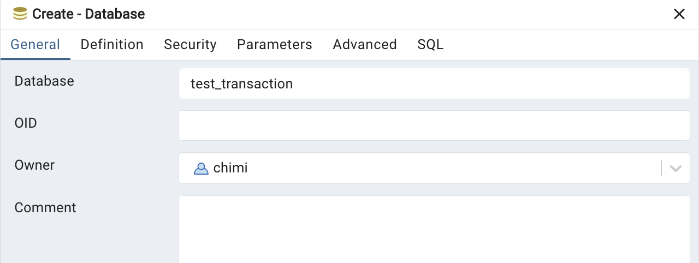
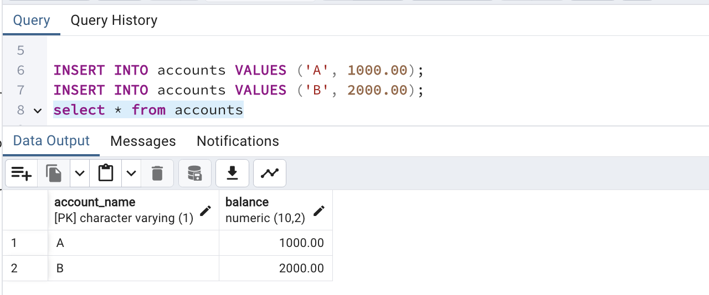

# Transaction

**What is transaction ?**

In a database management system (DBMS), a transaction is a sequence of one or more operations (such as read, write, update, or delete) executed as a single logical unit of work.

In databases,a transaction is a unit of program execution that accesses and possibly updates various data items.

The transaction consists of all operations executed between the **begin transaction** and **end transaction.**

### **Begain Transaction**

Begin Transaction marks the start of a new transaction. This indicates to the DBMS that all subsequent operations should be treated as a single, atomic unit of work. 

### **End Transaction**

End Transaction can mean either committing the transaction or rolling it back, depending on the outcome of the operations within the transaction block.

## Properties a transaction should possess

### Atomicity:

Atomicity is one of the core properties of database transactions, encapsulated within the ACID (Atomicity, Consistency, Isolation, Durability) principles that govern transaction management in database systems.

Atomicity ensures that a series of database operations within a transaction are treated as a single, indivisible unit of work. This means that either all operations in the transaction are executed successfully, or none of them are.

### Consistency:

Consistency is one of the core properties of database transactions, represented by the "C" in the ACID (Atomicity, Consistency, Isolation, Durability) principles.

In Database Management System (DBMS), consistency ensures that a transaction brings the database from one valid state to another valid state, maintaining the database's defined rules and constraints.

### Isolation:

Isolation is one of the key properties of database transactions, encapsulated within the ACID (Atomicity, Consistency, Isolation, Durability) principles.

In Database Management System (DBMS), isolation ensures that the operations of one transaction are hidden from other transactions until the transaction is committed, thereby preventing concurrent transactions from interfering with each other.

### Durability:

Durability property of DBMS is a important property if database that ensures that once a transaction is committed, its changes are permanent and will survive any system failures, such as crashes or power outages.

It guarantees that once data is written to the database, it will persist even in the event of hardware failures or software crashes.

***Lets imagine and understand what is actually happining***

Consider a transaction Ti that transfers $50 from account A
to account B.

The initial value of accounts: 

Account **A** is = $1000
Account **B** is = $2000

Steps involved are:

1. Transaction Ti reads the current balance of account A, which is $1000.
2. Transaction Ti subtracts $50 from the balance of account A.
3. After this operation, the balance of account A becomes $950.
4. Transaction Ti writes the new balance of account A, which is $950, back to the database.
5. Transaction Ti reads the current balance of account B, which is $2000.
6. Transaction Ti adds $50 to the balance of account B.
7. After this operation, the balance of account B becomes $2050.
8. Transaction Ti writes the new balance of account B, which is $2050, back to the database.

## Pactical Implementation of transaction in Posatgresql

**Steps Included:**

1. Lets create a database called **test_transaction** 

    

2. Lets create a new table call **accounts**

    

3. Inserting values inside the table **accounts**

    

4. ***OK! Now lets begain the transaction***

    

5. Start Transaction

    

    

6. From the accounts A and B, we will update the balance by either deducting or adding to the previous value.

    **Initial**
    
    
    **After updating**
    

7. Commiting the changes made in both the accounts and after commiting the changes we cannot perform ROLL BACK operation or undo the changes.

    

## Storage Structure in DB

Storage media categorized based on **speed**, **capacity**, and **resilience**:

1. Volatile storage
2. Non-volatile storage
3. Stable storage

### **1. Volatile storage**

* Volatile storage refers to computer memory that requires power to maintain the stored information.
* When the **power is turned off** or there is a system crash, the data stored in volatile storage is **lost**.
* This type of storage is typically used for temporary data that is needed during the processing of transactions but does not need to be permanently retained.
* Access is fast, allows direct access to data items.

### **2. Non-volatile storage**

* Non-volatile storage refers to computer memory that **retains stored data even when the power is turned off**.
* This type of storage is essential for databases to ensure data persistence, durability, and long-term retention of information.
* Non-volatile storage is used to store critical data such as database files, transaction logs, and backup files.
* Slower than volatile storage, especially for random
access.
- Susceptible to failures leading to data loss.

### **3. Stable Storage**

- type of storage that is highly reliable and ensures data durability and integrity even in the face of multiple failures, such as power outages, hardware malfunctions, or software bugs

- Achieved by replicating data in multiple non-volatile storage media with independent failure modes (usually disk)

**For a transaction to be durable:**
- Changes must be written to stable storage.

**For a transaction to be atomic:**
- Log records must be written to stable storage before any changes to the disk database.

- Log records each database modification, including transaction and data item identifiers, old and new values.

- Log-based recovery enables redoing or undoing modifications to ensure atomicity and durability.

- Committed transaction alters database into a new consistent state, persisting despite system failures.

- Committed transactions cannot be undone by aborting; compensating transactions may be necessary.

### Simple transaction state model

- Active: Initial state, transaction executing.

- Partially committed: After final statement execution.

- Failed: Normal execution can't proceed.

- Aborted: Rolled back, database restored to pre-transaction state.

- Committed: Successfully completed.

    

### To understand the **simple transaction model** lets perform some transactions

1. **Active State**

- When the instructions of the transaction are running then the transaction is in active state. 
- If all the ‘read and write’ operations are performed without any error then it goes to the “partially committed state”; if any instruction fails, it goes to the “failed state”.

- Begain the transaction

    

- Updating the value of Account_A 

    

2. **Partially Committed state**

- After completion of all the read and write operation the changes are made in main memory or local buffer. 
- If the changes are made permanent on the DataBase then the state will change to “committed state” and in case of failure it will go to the “failed state”. 

    

- Commiting the changes.

    

3. **Failed to Aborted**

- After entering the Failed state, the transaction can transition to Aborted by rolling back all changes.

- Initial State before transaction.

    

- Updating the value in account_B

    

- Performing ROLLBACK

    

4. **Active to Aborted**

- A transaction can also be explicitly aborted by the user or system, causing a direct transition from Active to Aborted.

- Updating the accounts table by adding a new account **D** and inserting value in account **D**.

    

- Performing ROLLBACK

    

    The Update operation performed to create a new accounts D is ROLLED BACK

5. **Partially Committed to Failed** 

- In some cases, a transaction might move from Partially Committed to Failed if an error is detected after the final statement but before committing.

    **Updating the the accounts table** by creating a new Account_E with balance of 1009
    
    **Commiting** the transaction.
    

- If a transaction enters the failed state after the
system determines that the transaction can no longer
proceed with its normal execution. Such a transaction must be rolled back. Then, it enters he aborted state.

### Transaction Atomicity and Durability

When a transaction fails and can't continue, it must be undone and marked as aborted. Then, the system has two choices:

- **Restart the Transaction:** This can be done if the failure was due to external issues (like hardware or software errors not caused by the transaction's own logic). The restarted transaction is treated as a new one.

- **Terminate the Transaction:** This should happen if the failure was due to an error in the transaction's own logic. In this case, restarting wouldn't help, so the transaction is just stopped.

### Transaction Isolation and Concurrency

- **Concurrent Transactions:** Multiple transactions run at the same time.
- **Challenges:** Allowing this can lead to complications and potential inconsistencies in the data.
- **Easier Solution:** Running transactions one after another (serially) avoids these issues but isn't efficient.

**Reasons for Concurrency:**

- Better Performance: Improved throughput and resource use.
- Less Waiting: Reduced wait times for transactions.

**Problem:**

Concurrent transactions might interfere with each other, risking data consistency.

**Solution:**

- Schedules: Used to manage the order of transaction execution, ensuring isolation and consistency.

- Concurrency-Control Schemes: Methods to control how transactions interact, ensuring they execute correctly together.

**Ensuring Consistency:**

- Serializable Schedules: These schedules behave as if transactions were run serially, maintaining consistency.

- Database System's Role: Ensures that all transactions follow these safe schedules to keep the database consistent.

### Serializability

- **Definition**: A schedule (order of operations) is serializable if it has the same effect as if transactions were executed one after the other in some order.
- **Importance**: Ensures that concurrent transactions result in a consistent database state, just like serial execution.

#### Key Concepts
- **Conflicting Instructions**: Two operations conflict if they:
  - Belong to different transactions
  - Access the same data
  - At least one is a write operation

- **Conflict Equivalence**: Two schedules are conflict equivalent if we can rearrange the non-conflicting operations in one to match the other.

- **Conflict Serializability**: A schedule is conflict serializable if it can be rearranged to a serial schedule by swapping non-conflicting operations.

#### Ensuring Consistency
- **Recoverable Schedules**: A transaction that reads data must commit after the transaction that wrote the data commits.
- **Cascadeless Schedules**: A transaction that reads data must wait until the writing transaction commits before it reads the data.

#### Isolation Levels
- **Serializable**: Ensures full serializability.
- **Repeatable Read**: Allows reading only committed data but not necessarily serializable.
- **Read Committed**: Only committed data can be read, but data can change during the transaction.
- **Read Uncommitted**: Allows reading uncommitted (possibly inconsistent) data.

#### Implementation Methods
- **Locking**: Use locks on data items and two-phase locking to ensure serializability.
- **Timestamps**: Order transactions by timestamps, aborting conflicting ones.
- **Multiple Versions**: Keep multiple data versions to provide snapshot isolation.

#### Examples
- **PostgreSQL 9.1+**: Uses Serializable Snapshot Isolation.
- **Oracle, SQL Server**: Have a Serializable isolation level, but it may not always be fully serializable.

